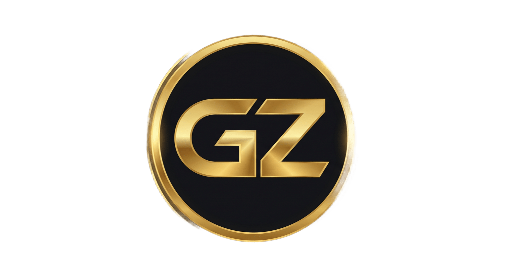

# Abd Alrahaman Mohamed

**Full-Stack Engineer  ·  AI Systems  ·  Applied Security Research**

Alexandria, Egypt  ·  Remote-first

---

- 🏆 Formalized **APDS — Asymmetric Patch Detection for Symmetric APIs** (new vulnerability-discovery methodology). First application: an un-patched symmetric sibling of CVE-2024-40658, **byte-identical across 6 AOSP branches for 25 months**. Submitted to Google ASR (**CVSS 10.0 Critical** · in panel review).
- 🛠️ Open-sourced the reference implementation at **[github.com/61465/apds-hunt](https://github.com/61465/apds-hunt)** within 24 h of submission (90-day SLA).
- ✅ **PostHog PR #5083 merged** (opt-in WebView bot detection, 11 days end-to-end).
- 🚀 **PostHog PR #5244 open** — ported upstream rrweb #1652 to fix a 9–10 s session-replay freeze on 13 k-node mounts (`MutationBuffer.processBufferedMutations` O(n²) → O(n)).
- 🚀 **Supabase storage PR #1488 open** — auto-select URL-signing JWK from `JWT_JWKS` (closes `#629`, open 607 days). 25 new tests including a JOSE round-trip proof.
- 🚀 **Supabase storage PR #1439 open** — UTF-8 object-key hardening + NFC normalization + lone-surrogate rejection.
- 📝 **Trigger.dev GHSA-65rr-73jq-6qhf accepted** (CVSS 9.6). **Documenso GHSA-2rp7-mrh6-v9m2 in triage** (CVSS 7.6, first-ever GHSA on the repo).

---

- **Top 16% (325 / 2,076 teams)** on Kaggle *AI Agent Security: Multi-Step Tool Attacks* — verified score **83.745**
- Reduced WhatsApp ban rate from Meta's 0.5% baseline to **0.1%** (5× improvement) via a 13-layer defense stack in production SaaS
- **90.6% adversarial containment at 5.9% FPR** on 8,000 seeded sessions — [Ariadne](https://ssrn.com/abstract=6870178) framework (SSRN preprint)
- Hospital-ready radiology AI: **69 s per 24-slice CT at 92% confidence** — midcine v3
- Shipped **134-agent NEXUS catalog** with MCP orchestration + a five-verifier grounding gate that removed 724 unsupported cyber claims across 770 production invocations

---

- **[apds-hunt](https://github.com/61465/apds-hunt)** — reference tool for the APDS methodology (XOR Rule theorem + 6-step algorithm). MIT. Oct 2026.
- **[Ariadne: Adaptive, Human-in-the-Loop Defense for AI Agents](https://ssrn.com/abstract=6870178)**  ·  SSRN 6870178  ·  Jun 2026
- **[Oblivion Gate: Zero-Trace Fragmentation in Distributed Data Architectures](https://papers.ssrn.com/sol3/papers.cfm?abstract_id=6602478)**  ·  SSRN 6602478  ·  May 2026

---

**Languages** · Python · TypeScript · JavaScript · Rust · Dart · SQL · LaTeX
**AI / ML** · PyTorch · Transformers · LoRA · DPO · Ollama · Claude API · MCP · RAG · LangGraph · multi-agent orchestration
**Web / Backend** · Next.js 15 · React · NestJS · FastAPI · Node.js · Express · Prisma · PWA · Turborepo · pnpm workspaces
**Healthcare** · DICOM · pynetdicom · highdicom · OHIF v3 · Cornerstone3D · FHIR R4 · HL7
**Cybersecurity** · WebAuthn/Passkeys · OAuth2 · SIEM · SOAR · EDR · YARA · pen testing (TCM-certified) · adversarial-AI defense · responsible disclosure (CVSS 3.1)
**DevOps** · Docker · Kubernetes · Firecracker · gVisor · Tailscale mesh · Cloudflare Tunnel · self-hosted PaaS (Ollama + Vaultwarden + Gitea + Grafana)

---

---

- **MEDNEXA** (Egyptian healthcare integration platform — HIS × LIS × PACS, HL7v2 + FHIR R4 + DICOM, PDPC-aligned audit) — [github.com/61465/MEDNEXA](https://github.com/61465/MEDNEXA)
- **Thawani** (WhatsApp Commerce SaaS, live paid tenants) — [thawani.cc](https://thawani.cc) · backup landing on GitHub Pages if the domain is down: [61465.github.io/thawanidemo](https://61465.github.io/thawanidemo/) · source: [github.com/61465/Thawani](https://github.com/61465/Thawani)
- **apds-hunt v0.1** (public reference tool for the APDS vulnerability-discovery methodology) — [github.com/61465/apds-hunt](https://github.com/61465/apds-hunt)
- **Nexus Zone portfolio companion** — [61465.github.io/Nexus_Zone_Portfolio_Companion](https://61465.github.io/Nexus_Zone_Portfolio_Companion/) · source: [github.com/61465/Nexus_Zone_Portfolio_Companion](https://github.com/61465/Nexus_Zone_Portfolio_Companion)

---

*Selected showcases from the ecosystem. Full source code, datasets, and proprietary models remain private for commercial and research reasons.*
